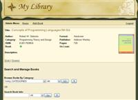

AV Book Library - About and Information
--------------------------------------------------------------------------------------

* IMPORTANT: THIS PROJECT IS ABANDONED / OUT OF DATE.
* Last tested on PHP v 5.6.
* (I may write a new version in the future.)

---

AV Book Library is a very simple online book library database application. It allows you to store your book information under categories (like: Fiction, Health, etc) along with the key book details like title, author, publisher, ISBN, pages, whether you have read it or not, whether you've loaned it to someone, a description of the book, etc.

AV Book Library version: 1.3.2 (September, 2013)

REQUIREMENTS:

- PHP v 5.6 or later.
- MySQL v 5.5 or later.
- The ability to make a directory writable by the web server, for use by the PHP copy() function.

AUTHOR:

Sherri Wheeler

CONTRIBUTORS:

- Jan De Luyck
- Scott Hampton

LICENSE:

See: public/license.txt and public/license-gpl.txt

INSTALL AND UPGRADE INSTRUCTIONS:

For all documentation including FAQ and install or upgrade instructions, refer to the included documentation directory for the latest information.
